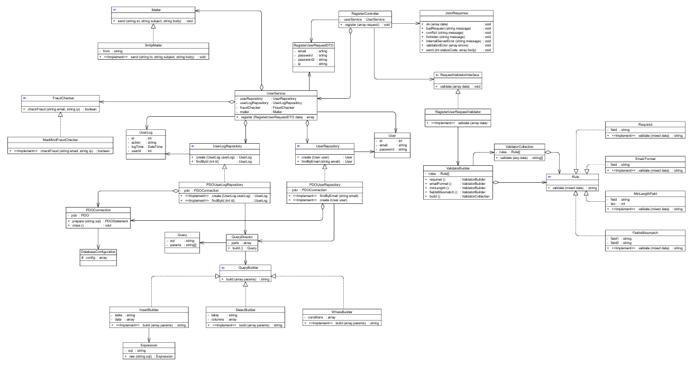

# Register App — refactored test assignment

This repository contains a fully refactored solution for the given PHP exercise.  

Concepts and techniques used:

* **S.O.L.I.D** principles  
* Design patterns  
* PSR-4 autoloading (Composer)  
* A minimal **QueryBuilder** with support for “RAW” SQL expressions (`NOW()`...)
* Clean architecture



## Getting Started

To set up and run the Register App, follow these steps:

1. **Clone the Repository**  
    Clone this repository to your local machine using the following command:  
    ```bash
    git clone https://github.com/DanijelaMilanovic/RegisterApp.git
    ```

2. **Start Docker Containers**  
    Navigate to the `docker` directory and start the Docker containers using `docker-compose`:  
    ```bash
    cd docker
    docker-compose up
    ```

3. **Set Up the Database**  
    - Open the file `documents/database-script.sql`.  
    - Copy the contents of the file and execute them on your database.

4. **Access the Application**  
    Send a POST request to `http://localhost:8000` to perform the registration.
